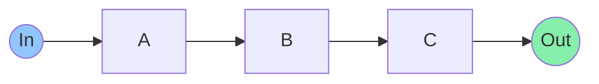
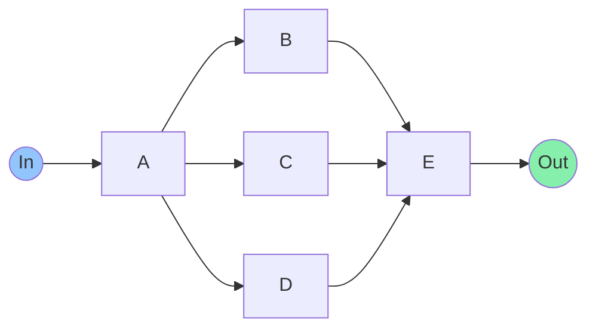
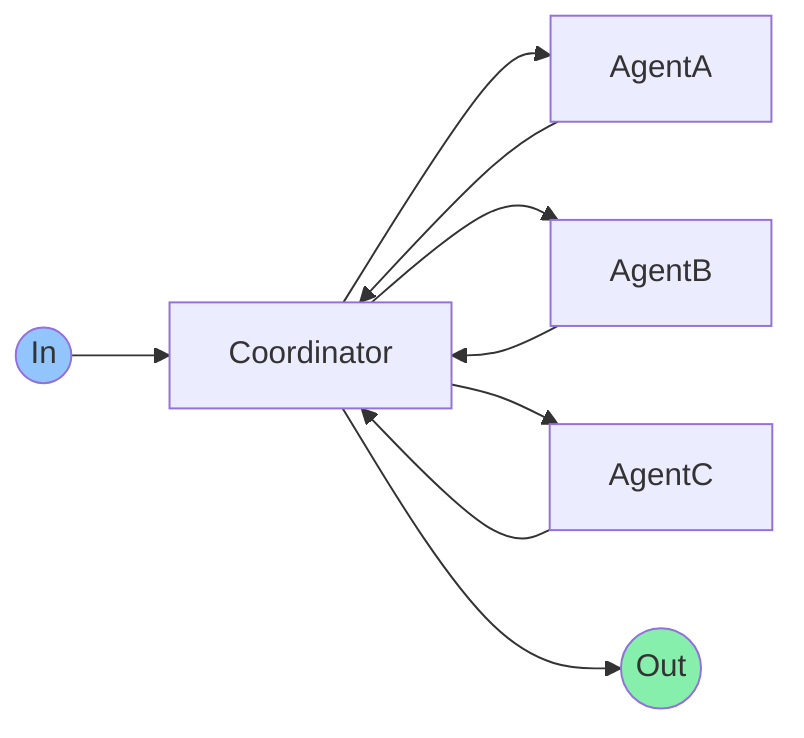
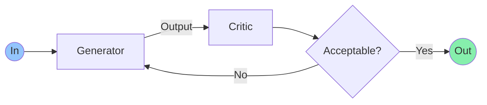
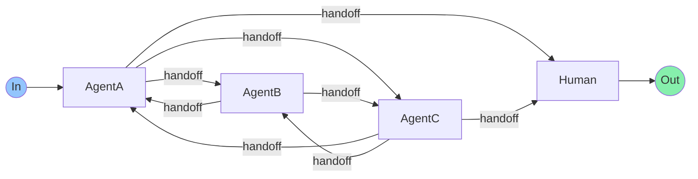
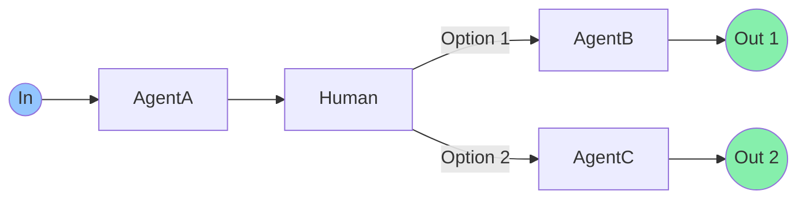

# Multi-Agent Design Pattern

## 1. Sequential
**Alias**: Sequential Workflow, Sequential pipeline Pattern

### Pattern

### Goal
Process data through a series of dependent steps where each step builds on the previous one.

## 2. Parallel
**Alias**: Fan-Out/Gather

### Pattern

### Goal
Distribute tasks across multiple agents simultaneously and consolidate results to improve efficiency.

## 3. Coordinator
**Alias**: Coordinator/Dispatcher Pattern, Group Chat, Supervisor-Worker pattern

### Pattern

### Goal
Manage workflow between specialist agents to leverage their unique capabilities effectively.

## 4. Reflection
**Alias**: Review/Critique Pattern, Generator-Critic, Evaluator-optimizer

### Pattern

### Goal
Enhance output quality through iterative feedback and refinement cycles.

## 5. Handoffs
**Alias**: Swarm

### Pattern

### Goal
Enable dynamic task delegation between agents based on expertise and availability.

## 6. Human in the loop
### Pattern

### Goal
Integrate human expertise and judgment at critical decision points in automated workflows.