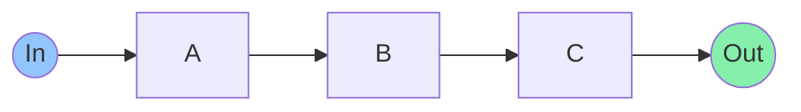
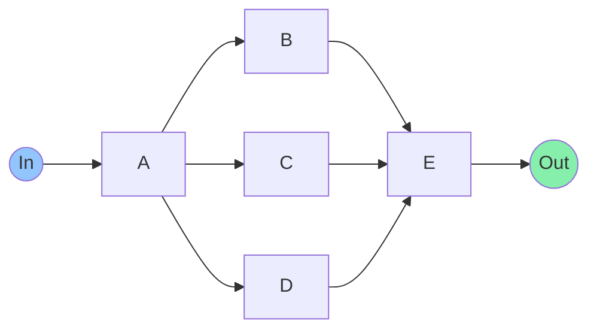
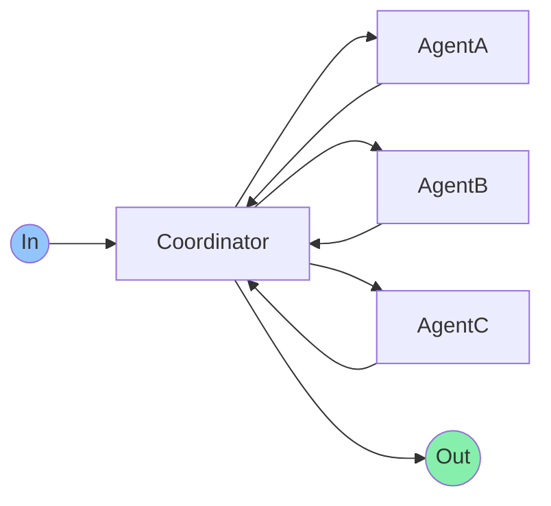
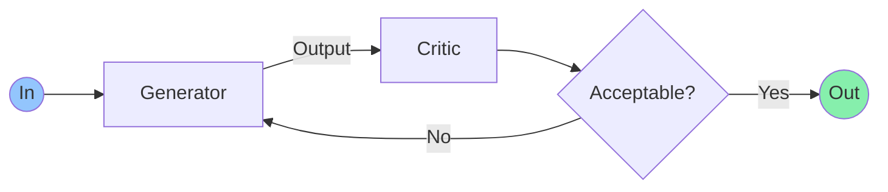
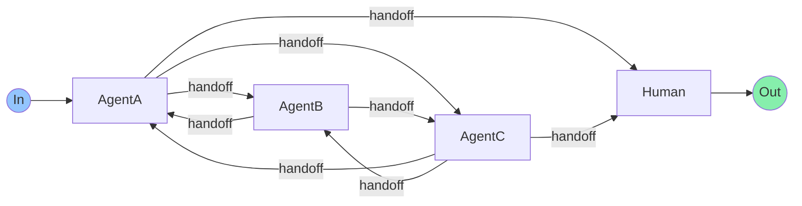

# Agent Design Pattern

## 1. Sequential
**Alias**: Sequential Workflow, Sequential pipeline Pattern

### Pattern

### Goal
Implement a multi-step process where the output of one step feeds into the next.

## 2. Parallel
**Alias**: Fan-Out/Gather

### Pattern

### Goal
 Execute independent tasks simultaneously to reduce **latency**, then combine their outputs.

## 3. Coordinator
**Alias**: Coordinator/Dispatcher Pattern, Group Chat

### Pattern

### Goal
Route incoming requests to the appropriate specialist agent.

## 4. Reflection
**Alias**: Review/Critique Pattern , Generator-Critic, Evaluator-optimizer

### Pattern

### Goal
Improve the quality or validity of generated output by having a dedicated agent review it.

## 5. Handoffs
**Alias**: Swarm

### Pattern

### Goal
Let agent delegate tasks to other agents using a special tool call.
